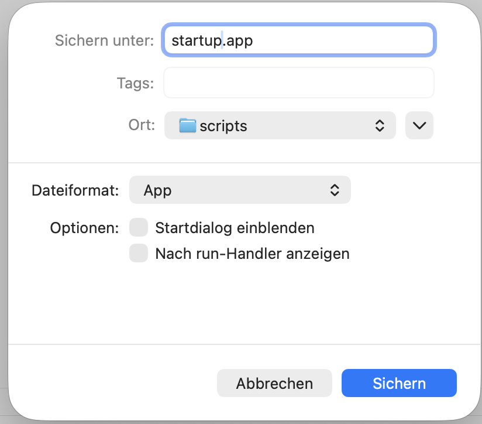

Mac eingeschaltet, Passwort eingetippt – und sofort startet ein ganzer Zoo an Apps gleichzeitig. Die Folge: Der Mac wirkt zäh, und besonders netzwerkabhängige Tools wie Mountain Duck oder andere File‑Provider verabschieden sich gleich wieder, da MacOS noch nicht bereit ist.
Der Haken: macOS bietet keine Möglichkeit, Login‑Apps gestaffelt oder mit einem Delay zu starten. Was als Anmeldeobjekt eingetragen ist, feuert das System stumpf parallel ab – ohne Rücksicht auf Reihenfolge oder Abhängigkeiten.

## Die Lösung: Ein AppleScript als "Traffic Controller"

Statt die Apps direkt in die Anmeldeobjekte zu werfen, habe ich ein kleines AppleScript geschrieben. Es übernimmt die Regie:

1.  Es wartet, bis das System "wach" ist.
2.  Es startet unwichtige Hintergrund-Tools.
3.  Es startet "schwere" Tools (wie File-Mounts) erst ganz zum Schluss.
4.  Optional: Es minimiert Fenster direkt, damit der Desktop sauber bleibt.

### Das Script

Hier ist der Code. Einfach in den **Skripteditor** (Script Editor.app) einfügen:

```applescript
(*
    Login-Startup-Script
    - wartet nach Login, bis Desktop halbwegs „fertig“ ist
    - startet Apps in definierter Reihenfolge
    - kann Fenster optional minimieren
*)

-- 🔧 Konfiguration
property initialDelay : 20 -- Sekunden nach Login warten
property defaultDelay : 1  -- Standard-Pause nach App-Start
property heavyDelay : 5    -- Für „schwere“ Apps oder FileProvider

-- Hilfsfunktion: App starten
on launchApp(appName, useActivate, minimizeWindows, pauseAfter)
    if useActivate then
        tell application appName
            activate
            if minimizeWindows then
                delay 0.5
                try
                    set miniaturized of windows to true
                end try
            end if
        end tell
    else
        -- nur starten, nicht in den Vordergrund zwingen
        tell application appName to launch
        if minimizeWindows then
            delay 0.5
            try
                tell application appName to set miniaturized of windows to true
            end try
        end if
    end if
    
    if pauseAfter > 0 then
        delay pauseAfter
    end if
end launchApp

--  Start-Reihenfolge

-- 1) Warten bis macOS WLAN/Netzwerk hat
delay initialDelay

-- 2) System-Tools & Utilities
launchApp("OpenIn", false, false, defaultDelay)
launchApp("TG Pro", false, false, defaultDelay)
launchApp("Supercharge", false, false, defaultDelay)

-- 3) Anybox starten und direkt minimieren
launchApp("Anybox", true, true, defaultDelay)

-- 4) Screenshot-Tool
launchApp("CleanShot X", true, false, heavyDelay)

-- 5) Mountain Duck: Erst starten, wenn alles andere läuft
launchApp("Mountain Duck", false, false, heavyDelay)
````

### Einrichtung

1.  Kopiere den Code in den Skripteditor.
2.  Drücke `Cmd + S` zum Speichern.
3.  **Wichtig:** Wähle beim Dateiformat **"Programm"** (Application) aus.
    


4.  Gehe in die **Systemeinstellungen -> Allgemein -> Anmeldeobjekte**.
5.  Füge dein neues Programm hinzu.